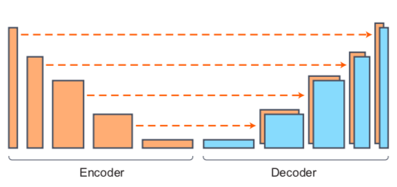
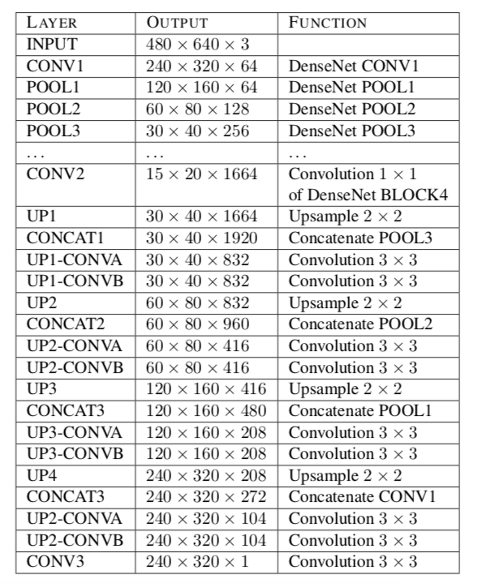
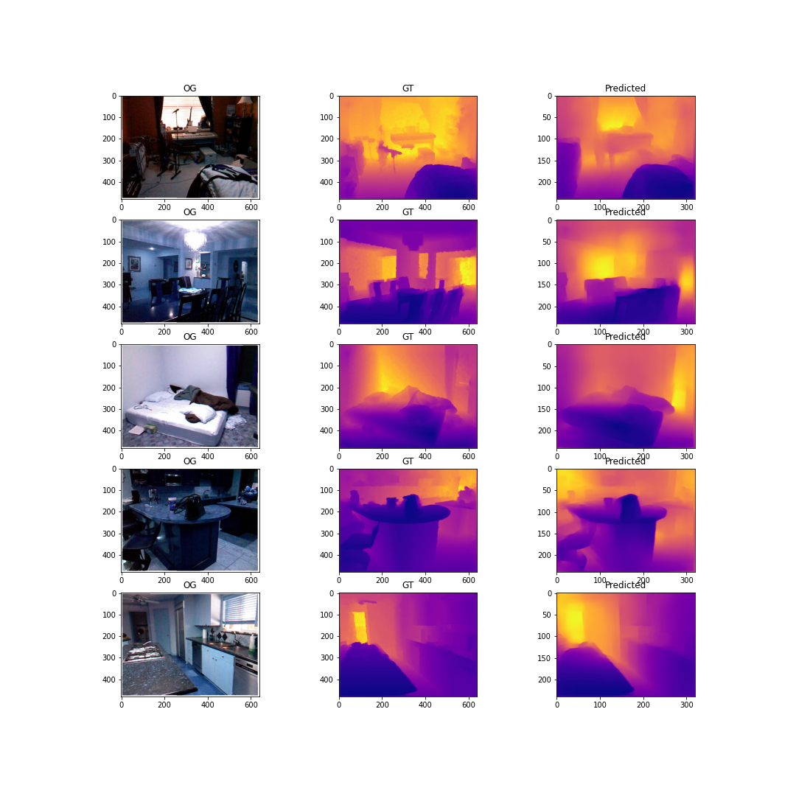
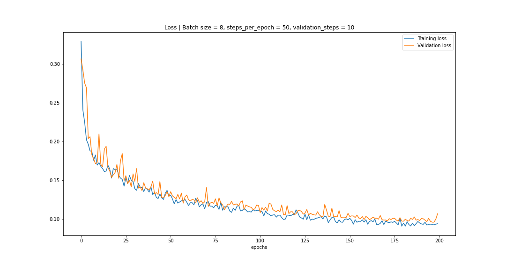

# Depth Map by Transfer Learning
A TensorFlow V2 implementation of _High Quality Monocular Depth Estimation via Transfer Learning_, [https://arxiv.org/abs/1812.11941](https://arxiv.org/abs/1812.11941).

## NN Architecture
DenseDepth uses an encoder-decoder architecture as shown in the figure. _[DenseNet169](https://arxiv.org/abs/1608.06993)_, pretrained for Image Classification on ImageNet, is used as encoder which converts input RGB image to feature vectors. Decoder consists of series of Upsampling layers which have skip-connections with the encoder. This model results in depth map at half the resolution of input image.

| | |
|--|--|
|Encoder-Decoder [1]|Layers [1]|

## Results
The model is trained on NYU Depth Dataset V2 [3].

||
|--|
|Results using a fraction of nyu depth dataset v2|

||
|--|
|Learning cruve|

### Quantitative Evaluation
|Th_1 (H) | Th_2 (H) | Th_3 (H) | rel (L) | rms (L) | log_10 (L)|
|--|--|--|--|--|--|
| 0.8226 | 0.9682 | 0.9940 | 0.1365 | 0.4884 | 0.0580 |

where,  
`rel` is mean relative error  
`rms` is root mean squared error  
`log_10` is average log error  
`Th_i` is threshold accuracy for `1.25, 1.25**2, 1.25**3`

## References
1. Ibraheem Alhashim and Peter Wonka, "High Quality Monocular Depth Estimation via Transfer Learning," 2018, [https://arxiv.org/abs/1812.11941](https://arxiv.org/abs/1812.11941)

2. [@ialhashim](https://github.com/ialhashim) - [DenseDepth](https://github.com/ialhashim/DenseDepth)

3. N. Silberman, D. Hoiem, P. Kohli and R. Fergus, "Indoor Segmentation and Support Inference from RGBD Images," ECCV, 2012

## Acknowledgements
Code borrows from [DenseDepth](https://github.com/ialhashim/DenseDepth).
